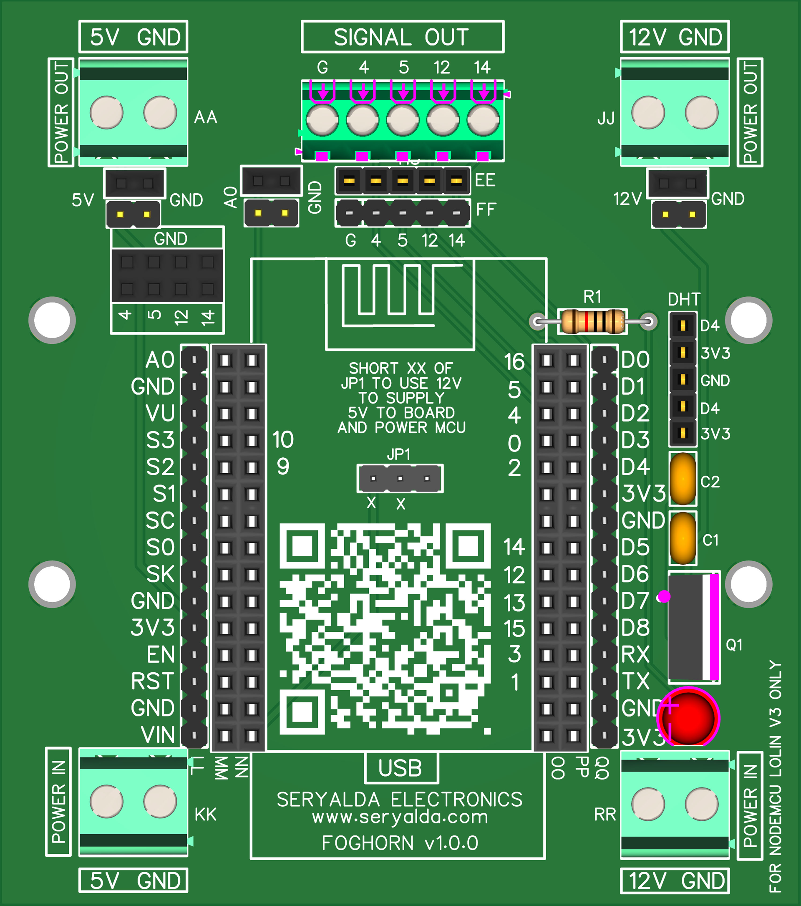
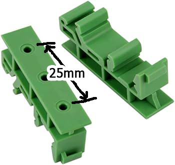

## Top
# 🎉 FOGHORN - ESP8266 NodeMCU v3 Compatible Expansion Board v1.0.0
### ◀️ [Back](/)

<!--📷-->

## Table of Contents

- 🌐 [Overview](#overview)
- ⭐ [Features](#features)
- 🤔 [Things you need to know](#things-you-need-to-know)
- ⚙️ [Installation](#installation)
- 🖥️ [Compatible Processor Boards](#compatible-processor-boards)
- ❓ [FAQ](#faq)
- 📜 [Disclaimer](#disclaimer)
- 📝 [Demo](#demo)

## Overview

FOGHORN is a specialized RAIL DIN board designed for seamless integration with ESP8266 NodeMCU v3 modules. Measuring 76mm x 86mm, this board features two screw holes with 25mm center to center apart, making installation easy. Equipped with 2 rows of 15-pin female headers, it simplifies the mounting of NodeMCU V3 modules.

The board boasts a 5-pin female header, offering the flexibility to integrate a DHT sensor into projects. With 5 terminal screw blocks and male/female headers mapped to GROUND, GPIO pins 4, 5, 12, and 14, users can assign and utilize these pins as output pins for their projects. Additionally, a 10-pin two-row female header allows quick LED testing of the 4, 5, 12, and 14 GPIO pins, facilitating hassle-free functionality checks without complicated wiring.

The inclusion of a 2-pin male and female header mapped to the A0 analog pin of the ESP module simplifies the connection of analog sensors without jumper wires. With two terminal blocks supporting 5VDC or 12VDC power options for the board and ESP module, this board provides a versatile solution for electronics projects.

### Features
- Compatible with ESP8266 NodeMCU V3 modules for seamless integration.
- Includes female headers for DHT sensor integration.
- Terminal blocks and male/female headers mapped to GROUND, GPIO pins for user flexibility.
- 10-pin female header for LED testing of GPIO pins, enabling easy functionality checks.
- 2-pin header for simplified connection of analog sensors to the A0 pin.
- Dual power options (5VDC/12VDC) for versatile project requirements.

[🔝 Top](#top)

## Things you need to know

NA

[🔝 Top](#top)

## Installation

Things and diagram you will need, for wiring and to implement RAIL DIN configurations:

| How to Wire Diagram | Sample Wiring | Slotted Metal Rail DIN  | Screws M3 D=3mm, L=6mm   | Mounting Brackets (25mm center to center) |
|--------------------|--------------------------------------------|-------------------------------------------------------------------------------------------------------|--------------------------------------------------------------------------------------------------------------------------------------------------|---------------|
|  |  |  |  |  |
|||[🛍️ BUYHERE](#)|[🛍️ BUYHERE](#)|[🛍️ BUYHERE](#)|

  
[🔝 Top](#top)

## Compatible Processor Boards

DAWG Board v1.0.0 also works with below Processor Board:

| Board              | Link                                       | Image                                                                                                 | Description                                                                                                                                      | GPIO Output Pins     |
|--------------------|--------------------------------------------|-------------------------------------------------------------------------------------------------------|--------------------------------------------------------------------------------------------------------------------------------------------------|---------------|
| **Foghorn v1.0.0** | [FOGHORN](https://github.com/seryalda/foghorn) |  | The board integrates with the Foghorn Version 1.0.0 Processor Board. It's an ESP8266 NodeMCU v3 compatible board with a screw terminal block output mapped to GPIO pins 4, 5, 12, and 14, allowing control of up to 4 external switch relays or CONTACTORS. | 4, 5, 12, 14 |

Explore the compatibility of DAWG with these processor boards to enhance your projects.

[🔝 Top](#top)

## FAQ

N/A

[🔝 Top](#top)

## Disclaimer

NA

[🔝 Top](#top)

## Demo

[🔝 Top](#top)
